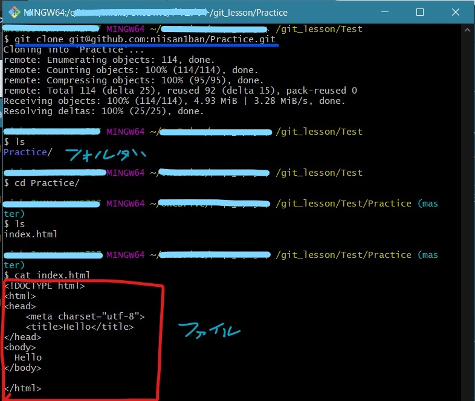

<!-- MarkDown記法メモ
      #の数だけ見出しの階層
      半角スペ2つで改行
      >で引用
      *でリスト（タブで階層表示）数字のときは数字　-でも可能
      3つ以上の-、*、_を並べて水平線が引ける
      インライン記法のリンク表記は[サイト名](URL)といったように
      *斜体*　**太字**　***斜体太字***　_でも可能
      で画像
      ~~打ち消し~~
      \[^注釈]:テキスト
      <font color="#000000">文字色</font>
      \'マークダウン打ち消し''
      'インライン'　マーカーを引ける
      '''html:title
        <p>ここの中身で構文の色が変わって見える　コードを挿入</p>
      '''
      | 列頭 | 列頭 |
      | :--- | :---: |
      | 左寄せ | 右寄せ | 要素の前後にはスペース

-->
# GitHubの使い方台本

## 目次
1. [AがGitHub上にリモートリポジトリを用意し、"Hello"とだけ書かれたindex.htmlファイルを入れる](#chapter1)
2. [BがローカルPCにHTMLファイルを取り込み、編集してAにプルリクエストする](#chapter2)
3. [AがBのプルリクエストをmasterブランチにマージする](#chapter3)
4. [AがBの編集した内容をローカルPCに取り込み、index.htmlを編集してmasterブランチにマージさせる](#chapter4)
5. [BがAの編集した内容をローカルPCに取り込み、stylesheet.cssを追加、Aにプルリクエスト](#chapter5)
6. [AがBのプルリクエストをmasterブランチにマージする](#chapter6)


<a id="chapter1"></a>

## 1. AがGitHub上にリモートリポジトリを用意し、"Hello"とだけ書かれたindex.htmlファイルを入れる  

### AがGitHub上にリモートリポジトリを用意する

  1. ブラウザで[GitHub](https://github.com/)にアクセスし、右上の+マークを押して「New repository」を選択する。

  

  2. Repository name（リポジトリ名）を入力する。今回は「Practice」にした。必要ならばDescription（説明文）も入力する。その下のラジオボタンはPublicを選択し、Create repositoryをクリックする。

  |選択肢|内容
  |--|--
  |Public|誰もが閲覧可能な公開リポジトリを作成する
  |Private|許可した人しか見られない非公開リポジトリを作成する

  

  3. Git Bashを起動し、任意の場所にPracticeディレクトリを作成し(mkdir)移動する(cd)。**git init** でローカルリポジトリを作成し、**git remote add** でリモートリポジトリの設定を行う。リモートリポジトリのURLは、Codeタブ内のQuick setupで確認できる。[[1]](#note1)

  ```
  $ mkdir Practice
  $ cd Practice
  $ git init
  $ git remote add origin <リモートリポジトリのURL>　
  ```

  
  

### Aがindex.htmlファイルを作成し、リモートリポジトリに上げる

  1. Practiceディレクトリ内でindex.htmlを作成し、以下の内容で保存した。Git Bashのコマンドでtouch index.htmlと入力する方法でも作成可能。

  

  2. git addコマンドでindex.htmlをコミット対象に設定する。その後、git commitコマンドでコミットする。このとき、-mオプションでコミットメッセージが設定できる。  

  ```
  $ git add index.html
  $ git commit -m "create index.html"
  ```

  3. git pushコマンドでプッシュを行う。ここでのoriginはリモート名、 masterはブランチ名を指す。

  ```
  $ git push origin master
  ```

  

  4. リモートリポジトリにindex.htmlが存在することを確認する。

  
  

<a id="chapter2"></a>

## 2. BがローカルPCにHTMLファイルを取り込み、編集してAにプルリクエストする  

### AがBをコラボレーターとして招待する

  1. ①Settingタブに切り替え、左側のメニューから②Manage accessをクリックする。次に③Invite a collaboraterをクリックする。

  

  2. 招待したい人(B)のユーザー名を①入力すると、該当するユーザーが表示されるのでクリックする。その後、②緑色のボタンをクリックする。

  

  3. 招待したユーザー(B)にメールが届くので、招待を受けてもらうとBが正式にコラボレーターになる。   

  
    

  コラボレーターとして承認されたら、この画面に遷移する。
  

### BがリモートリポジトリからローカルPCをに取り込み、ファイルを編集する

  1. BがGit Bashを起動し、作業したい場所にカレントディレクトリを移動させる。Aと同じくgit initでローカルリポジトリを作成し、**git cloneでリモートリポジトリの中身を複製させる**。  
  lsとcatでフォルダとファイルの中身を確かめると、リモートリポジトリ（Practice）の中身がそのままローカルPCに落とされていることが分かる。<font color="red">この時点で既にリモートリポジトリのURLは登録されているのでgit add originは不要</font>。  

  ```
  $ git clone <リモートリポジトリのURL>  
  ```  

  

  2. 落としてきたindex.htmlに編集を加える。  

     


### Bがブランチを作成し、そこにファイルをプッシュしてAにプルリクエストする

  1. 通常の開発では、ブランチを用いて並行的に作業し、変更をmaster（主軸）にマージさせる方法をとるため今回もそれに倣うことにした。今回はsubブランチを立て、そこに編集したファイルをプッシュする。まずは**git branch**でブランチを立て、**git chekout**で作成したブランチに切り替える。  

  ```
  $ git branch sub  #subブランチを立てる
  $ git checkout sub　#subブランチに切り替える
  $ git branch　#現在のブランチを確認する
  ```   

  2. Aのときと同じく、編集したindex.htmlをコミット、そしてプッシュする。このとき注意すべきなのが、<font color="red">git push origin <ブランチ名> </font>とすることである。  

  ```
  $ git add index.html
  $ git commit -m "Create branch and Change index.html"

  $ git push origin sub　#subブランチに上げること！！
  ```  

  3. GitHubでリモートリポジトリのmasterブランチの画面を見ると、subブランチからプルリクエストをするようにボタンがあるのでプルリクエストを行う。  

    

  4. compareに先程作業して上げたブランチ(sub)、baseにmasterブランチとReviewersに作業者のアカウントがあることを確認し、必要に応じて修正コメントを加えてプルリクエストを実行する。題名はコミットメッセージになっている。

  　

<a id="chapter3"></a>

## 3. AがBのプルリクエストをmasterブランチにマージする  

  1. ①Pull requestsタブを選択し、②開きたいプルリクエストをクリックすると、選んだプルリクエストが表示される。

  
  

  2. Commitsタブや、Files changedタブで変更点を確認する。

  
  

  3. 問題がない場合は、**Merge pull request** をクリックし、コミットメッセージを入力して **Confirm merge**をクリックする。

  
  

  4. これで、マージコミットが追加された。subブランチは不要なのでDelete branchをクリックして削除する。

  

<a id="chapter4"></a>

## 4. AがBの編集した内容をローカルPCに取り込み、index.htmlを編集してmasterブランチにマージさせる　　

  1. **git pull**コマンドで、ローカルリポジトリにリモートリポジトリのデータを取り込む。git cloneと異なるのは、<font color="red">既に登録されているリモートリポジトリ</font>の中身を引っ張ってくる点にある。

  ```
  $ git pull origin master
  ```

  2. index.htmlに変更を加える。ここでは、13行目にdivタグを追加した。

  

  3. git addコマンドでindex.htmlをコミット対象に設定する。次に、git commitコマンドでコミットする。そして、git pushコマンドでプッシュする。Aはメイン開発者であるためmasterブランチにプッシュを行う。

  ```
  $ git add index.html
  $ git commit -m "update index.html"
  $ git push origin master
  ```

<a id="chapter5"></a>

## 5. BがAの編集した内容をローカルPCに取り込み、stylesheet.cssを追加、Aにプルリクエスト　　

  1. subブランチからmasterブランチに切り替え、 **-d** でsubブランチを削除する。

  ```
  $ git checkout master
  $ git branch -d sub
  ```

  2. git pullコマンドで、ローカルリポジトリにリモートリポジトリのデータを取り込む。　　

  ```
  $ git pull origin master
  ```

  3. 新たに、**sub2ブランチ**を作成し、切り替える。

  ```
  $ git branch sub2
  $ git checkout sub2
  ```

  4. ローカルリポジトリ内にtouchでstylesheet.cssを作成する。その後、CSSファイル内に記述を追加する。

  ```
  $ touch stylesheet.css
  ```

  

  5. cssファイルをコミットし、リモートリポジトリの**sub2ブランチ**にプッシュする。

  ```
  $ git add stylesheet.css
  $ git commit -m "add css file."
  $ git push origin sub2　#ブランチは確認しておく
  ```
  6. プッシュできたら2章のときと同様に、プルリクエストを要求する。

<a id="chapter6"></a>

## 6. AがBのプルリクエストをmasterブランチにマージする

  3と同様の方法で、sub2ブランチをmasterブランチにマージする。マージが完了したら、リモートのsub2ブランチはDelete branchボタンで削除する。Bのローカルリポジトリで作成したsub2ブランチも削除しておく。


***
<注釈>  
<a id="note1">[1]: Aと同じく、リモートリポジトリのCodeのタブにある[Code]ボタンを押すとHTTPS,SSHといったタブが出現しURLが記載されているのでそれをコピーする。これの場合は [https ://github.com/ユーザー名/リポジトリ名.git] 。なお、SSHの方はHTTPS接続の際にパスワード要求しなくて済むための鍵認証する際に利用するが、詳細は割愛する。
 なお、HTTPS接続する際にはこのような認証画面が出てくるのでGitHubのユーザー名およびパスワードを入力する。
 　　　
 
</a>